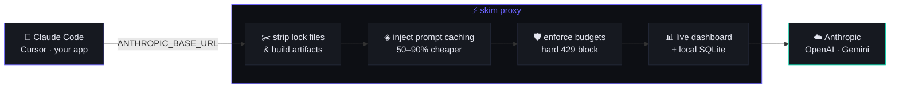

<div align="center">

<picture>
  <source media="(prefers-color-scheme: dark)" srcset="https://img.shields.io/badge/skim-runtime%20token%20intelligence-6c63ff?style=for-the-badge&labelColor=0a0c10">
  
</picture>

# `skim`

### Stop paying for tokens you never meant to send.

The runtime layer that sits between your AI tools and the LLM API —
**stripping waste, injecting caching, and showing you exactly where every token goes.**

<br/>

[](https://pypi.org/project/skim-llm/)
[](https://pypi.org/project/skim-llm/)
[](https://www.python.org/)
[](LICENSE)
[](pyproject.toml)

<br/>

[**⚡ Quickstart**](#-quickstart) &nbsp;·&nbsp;
[**🔍 How it works**](#-how-it-works) &nbsp;·&nbsp;
[**📊 Dashboard**](#-dashboard) &nbsp;·&nbsp;
[**🏢 Enterprise**](#-enterprise) &nbsp;·&nbsp;
[**⌨️ CLI**](#️-cli-reference) &nbsp;·&nbsp;
[**📚 Docs**](docs/) &nbsp;·&nbsp;
[**▶️ Live Demo**](https://demo-mu-ten-60.vercel.app)

</div>

<br/>

> [!NOTE]
> **One env var. Zero code changes.** Claude Code reads a `package-lock.json` — 122k tokens, $0.37 — just to answer a question about a 200-line file. History compounds. Your context window fills silently and quality degrades while you fly blind. skim fixes this in the API call path, in real time.

<br/>

<div align="center">



</div>

<br/>

## ⚡ Quickstart

<table>
<tr>
<td width="50%" valign="top">

**1. Install**

```bash
pip install skim-llm
```

**2. Start the proxy**

```bash
skim proxy
```

Browser opens automatically to your live dashboard.

**3. Point your tool at it**

```bash
export ANTHROPIC_BASE_URL=http://localhost:7474
```

</td>
<td width="50%" valign="top">

**That's it.** Every call now flows through skim.

```
┌────────────────────────────────────┐
│  skim v0.5.0  — runtime token proxy │
├────────────────────────────────────┤
│  listening  localhost:7474          │
│  dashboard  localhost:7474/dashboard│
│  filtering  ✓ on                    │
│  caching    ✓ on                    │
├────────────────────────────────────┤
│  ⠋ LIVE  waiting for calls...       │
└────────────────────────────────────┘
```

</td>
</tr>
</table>

> [!TIP]
> **No API key? No problem.** skim auto-detects your plan — `x-api-key` for API users, `Authorization: Bearer` for **Claude Pro / Max** users — and routes each accordingly. Pro users get full waste filtering and tracking out of the box.

<br/>

## 🔍 How it works

<table>
<tr>
<td width="33%" valign="top" align="center">

### ✂️
**Waste filtering**

Detects lock files, build artifacts & generated code inside `tool_result` blocks and strips them before they hit your context.

`package-lock.json` → a 12-token note instead of 122k tokens.

</td>
<td width="33%" valign="top" align="center">

### ◈
**Caching injection**

Wraps your system prompt + large context with `cache_control` automatically.

First call caches it. Every call after is **free**. CLAUDE.md loads at zero cost on calls 2+.

</td>
<td width="33%" valign="top" align="center">

### 📊
**Live dashboard**

Opens in your browser on start. No login, no setup. Persists to `~/.skim/events.db`.

Real-time SSE updates — watch tokens & cost as they happen.

</td>
</tr>
</table>

<details>
<summary><b>Auto-detected waste signatures</b></summary>

<br/>

| File | Detected by |
|------|-------------|
| `package-lock.json` | `"lockfileVersion"` + `"resolved": "https://"` |
| `yarn.lock` | `# yarn lockfile v1` + `resolved` |
| `pnpm-lock.yaml` | `lockfileVersion:` + `resolution:` |
| `Cargo.lock` | `@generated` + `[[package]]` |
| `poetry.lock` | `@generated` + `[[package]]` |
| `composer.lock` | `"content-hash":` + `"packages":` |

Plus anything in your project's `.llmignore`. Stripped blocks are replaced with a one-line note showing what was removed and how to disable it.

</details>

<details>
<summary><b>How plan detection works</b></summary>

<br/>

One method, `_auth_type()`, owns all routing logic:

```python
_auth_type() → ("apikey", key)    # API plan      → filtering + caching + tracking
             → ("oauth",  token)  # Pro/Max plan  → filtering + tracking (no cache injection)
             → ("", "")           # no auth       → 401
```

Adding a new plan type (enterprise SSO, team tokens) is a single `elif`. Caching injection is skipped for Pro/OAuth because the Pro plan manages its own cache layer.

</details>

<br/>

## 📊 Dashboard

Five fully-built pages. Dark theme, live charts, real-time SSE updates — no refresh button needed.

<div align="center">

| 🟣 Overview | ⚡ Sessions | 📈 Usage | 🤖 Models | 💰 Savings |
|:---:|:---:|:---:|:---:|:---:|
| tokens, cost,<br/>savings, cache | full call log,<br/>searchable | hourly +<br/>daily charts | cost/1k,<br/>cache %, waste % | cumulative<br/>savings & ROI |

</div>

```bash
skim proxy              # local dashboard, zero setup, opens in browser
```

The local dashboard works for everyone — solo devs, Pro users, anyone. Data never leaves your machine unless you explicitly connect a team server.

<br/>

## 🏢 Enterprise

> [!IMPORTANT]
> Everything below is **open-source and self-hosted** — same pip package, no paywall, no telemetry.

<table>
<tr>
<td width="50%" valign="top">

#### 🛡️ Budget enforcement
Hard-block calls that exceed token/cost limits. Proxy returns `429` before forwarding.

```bash
skim admin budget set --owner-type team \
  --owner-id engineering --usd 500 --period monthly
```

#### 🔔 Webhook alerts
Slack (& Teams) or any HTTP endpoint on budget events.

```bash
skim admin webhooks add --channel slack \
  --url https://hooks.slack.com/...
```

#### ✉️ User invites
Self-registration via single-use links. No manual accounts.

```bash
skim admin users invite --email new@corp.com \
  --role user --team platform
```

</td>
<td width="50%" valign="top">

#### 🔑 Scoped API keys
`ingest` · `read` · `admin` — with expiry dates and revocation.

#### 👥 RBAC
`admin` · `team_admin` · `user` — enforced data isolation per role.

#### 📋 Audit log
Every sensitive action logged immutably. Queryable by action + date.

```bash
skim admin audit --days 30 --action auth.login
```

#### 📤 Data export
CSV event logs + JSON summaries for accounting & BI.

```bash
skim admin export --days 30 --out report.csv
```

</td>
</tr>
</table>

<details>
<summary><b>Team deployment in 3 commands</b></summary>

<br/>

```bash
# 1. Run the server (auto-creates admin, uses gunicorn if installed)
pip install 'skim-llm[web]'
SKIM_ADMIN_EMAIL=you@corp.com skim server --host 0.0.0.0 --port 7475

# 2. Each developer connects their proxy
export SKIM_SERVER_URL=https://skim.corp.internal
export SKIM_SERVER_TOKEN=sk-skim-...     # generate in Settings

# 3. Manage from anywhere
skim admin users list
```

**Auth:** local password · LDAP/AD (`SKIM_LDAP_*`) · Google/GitHub/Azure/Okta (`SKIM_OIDC_*`)

Full guide → [docs/enterprise.md](docs/enterprise.md) · [docs/deployment.md](docs/deployment.md)

</details>

<br/>

## ⌨️ CLI Reference

<table>
<tr>
<td width="50%" valign="top">

**🔬 Static analysis** &nbsp;<sub>no API key</sub>

```bash
skim scan       # token cost per file
skim analyze    # detect waste patterns
skim fix        # auto-write .llmignore
skim check      # CI budget gate
skim generate   # .llmignore + CLAUDE.md
skim secrets    # leaked credential scan
```

</td>
<td width="50%" valign="top">

**⚙️ Runtime & ops**

```bash
skim proxy      # the interceptor
skim server     # team dashboard + API
skim admin      # manage users/budgets/keys
skim audit      # local operation log
skim hooks      # git pre-commit gate
skim baseline   # token regression checks
```

</td>
</tr>
</table>

<details>
<summary><b>Example — <code>skim fix</code> auto-cleanup</b></summary>

<br/>

```
  skim fix  —  ./my-project
  ──────────────────────────────────────────────────────
  Before  : 166.8k tokens  (83.4% ctx)  $0.50/session

  Pattern              Severity    Tokens saved  Rules
  ────────────────────────────────────────────────────
  Lock files           HIGH           160.3k     +7
  Test snapshots       MEDIUM           4.1k     +2

  ✓ Written to .llmignore

  After   : 6.5k tokens  (3.2% ctx)  $0.02/session
  Saved   : 160.3k tokens  (96.1% reduction)  $0.48/session
  Now     : 51 sessions / $1
```

</details>

<br/>

## 🐍 Python API

```python
from adapters import ClaudeAdapter

claude = ClaudeAdapter(
    model="claude-sonnet-4-6",
    system_prompt="You are a terse coding assistant.",
    enable_caching=True,          # prompt caching, automatic
)
response = claude.chat("Refactor the auth module")
claude.print_stats()
# Session: 12,400 tokens | Cache hit rate: 87% | Cost: $0.0037
```

<sub>Adapters: `ClaudeAdapter` · `OpenAIAdapter` · `GeminiAdapter` · `OllamaAdapter`</sub>

<br/>

## 📦 Install

<table>
<tr>
<td>

```bash
pip install skim-llm                    # core — zero hard deps
pip install 'skim-llm[tiktoken]'        # accurate token counting
pip install 'skim-llm[web]'             # dashboard server
pip install 'skim-llm[web,sso,ldap]'    # enterprise auth
pip install 'skim-llm[all]'             # everything
```

</td>
</tr>
</table>

<br/>

## 📚 Documentation

<div align="center">

| Guide | What it covers |
|:------|:---------------|
| [**Quickstart**](docs/quickstart.md) | Zero to running in 2 minutes |
| [**Proxy**](docs/proxy.md) | Deep-dive — every feature, every flag |
| [**Dashboard**](docs/dashboard.md) | Local & team dashboards |
| [**Enterprise**](docs/enterprise.md) | Budgets, webhooks, invites, RBAC, audit |
| [**Admin CLI**](docs/admin-cli.md) | `skim admin` complete reference |
| [**REST API**](docs/api.md) | All 31 endpoints with schemas |
| [**Configuration**](docs/configuration.md) | Every env var & `.skimrc` option |
| [**Deployment**](docs/deployment.md) | Docker, systemd, nginx, scaling |
| [**MCP Setup**](docs/mcp-setup.md) | Claude Desktop integration |

</div>

<br/>

## 🔌 MCP Server

```json
{ "mcpServers": { "skim": { "command": "skim-mcp" } } }
```

<sub>Tools: `scan_tokens` · `analyze_context` · `check_budget` · `fix_context` · `generate_llmignore`</sub>

<br/>

---

<div align="center">

<sub>

**[GitHub](https://github.com/bb1nfosec/skim)** · **[PyPI](https://pypi.org/project/skim-llm/)** · **[Issues](https://github.com/bb1nfosec/skim/issues)** · **[Changelog](CHANGELOG.md)** · **[Live Demo](https://demo-mu-ten-60.vercel.app)**

Built for developers who'd rather not pay for noise. · MIT License

</sub>

<sub>⭐ Star the repo if skim saved you some tokens.</sub>

</div>
